# Self Driving Lab - Closing the loop at Argonne APS


## Using AWS Robomaker to get U3E robots working in simulation mode using Gazebo

The goal is to get ROS working using AWS Robomaker with a UR3E (Universal Robot) working in a Gazebo simulation mode. Next, we want to integrate EPICS/BlueSky to get data from beamline. We want to use the data from beamline streamed and determine an action based on the data and have the simulation in Gazebo updated. Subsequently, we will replace Gazebo with real robot control.

I found that AWS RoboMaker to the fastest way to setup a collaborative development environment (especially if you have a macOS laptop). All of these instructions worked well on OS X with Google Chrome browser. The costs of my experiments on AWS was fairly low -> $1.68.

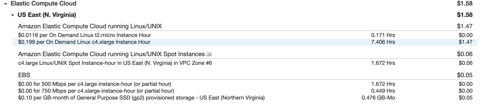

## Using AWS RoboMaker to set ROS environments for Robot development

1. Create a AWS account at [AWS](https://aws.amazon.com) using your email address
2. In the AWS console, go to RoboMaker service and click on Development environments - Select create development environment 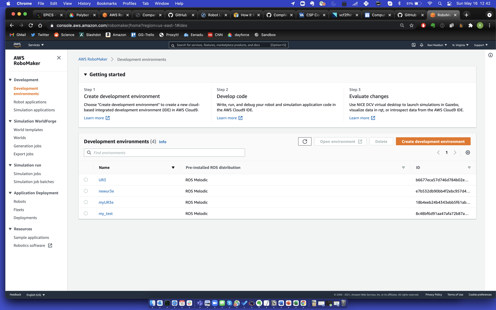
3. 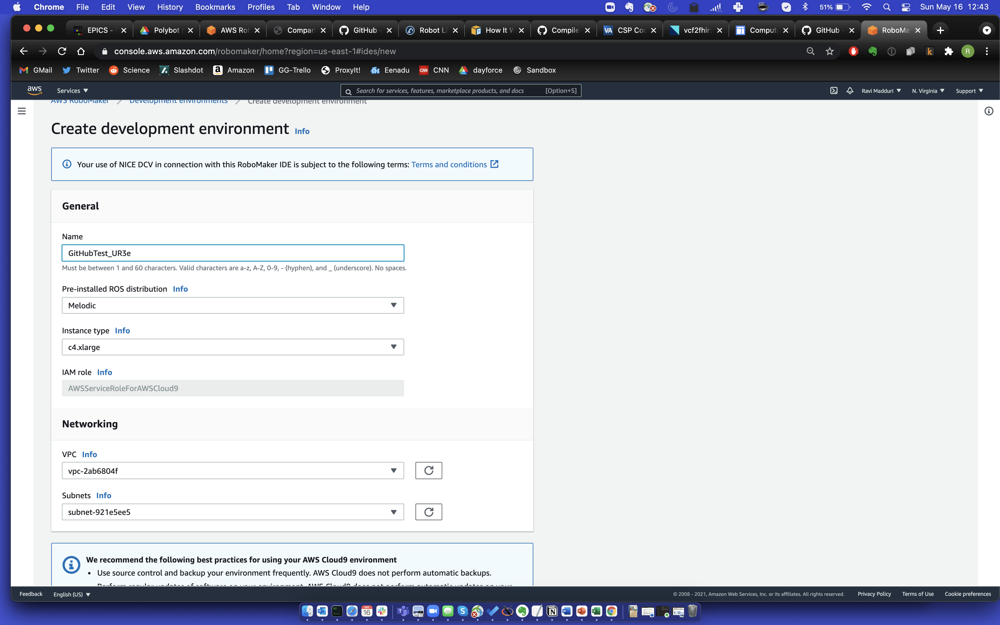 
4. Launching RoboMaker 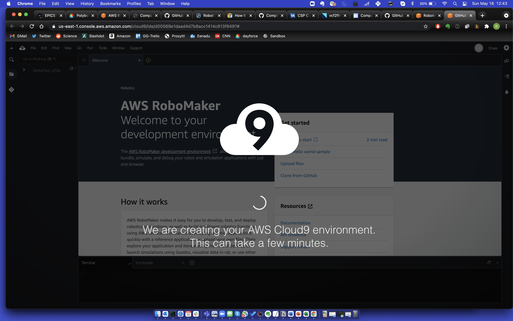
5. RoboMaker is launched. You will see the command window below and an option to launch Virtual Desktop. In the command window run ```export DISPLAY=:1```  which will set X to the virtual desktop 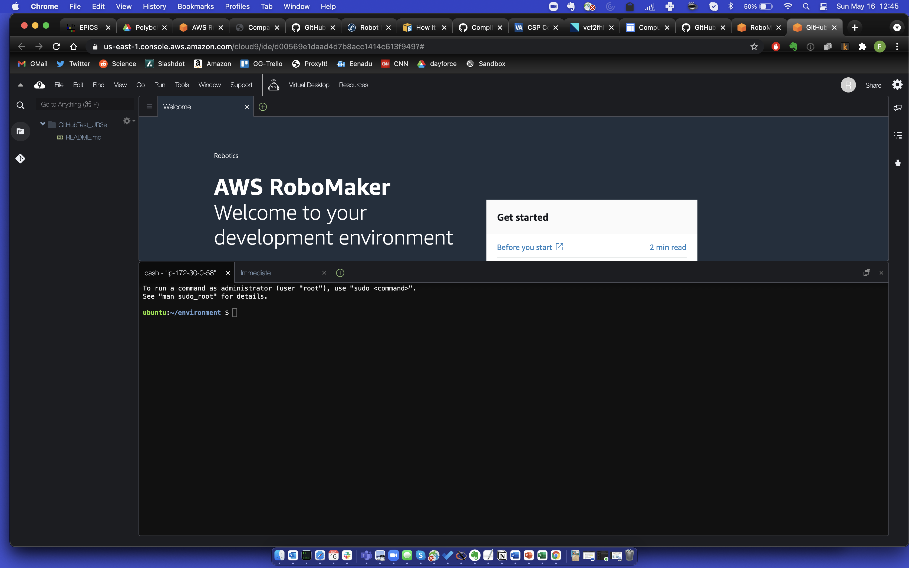
7. Virtual Desktop that is launched will open in a new browser window  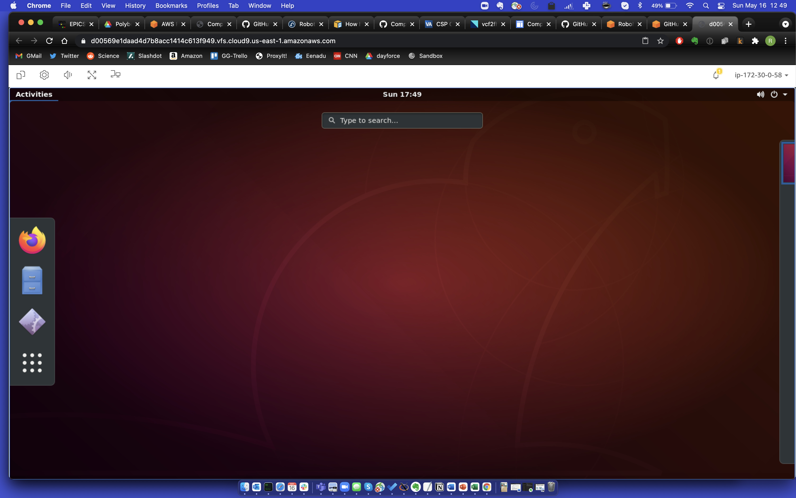
8. In the Virtual Desktop, find "Activities" and type Gazebo 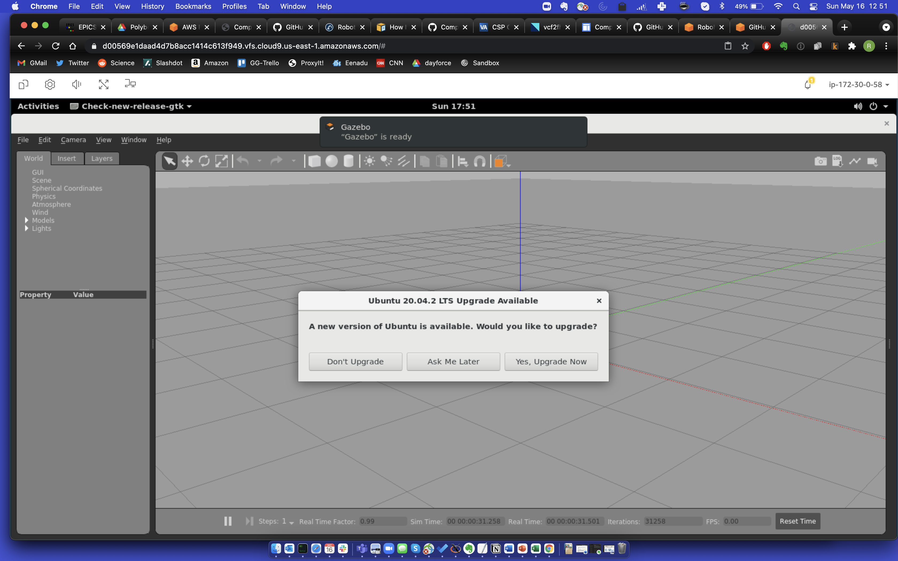
9. Empty virtual world launched using Gazebo 
10. Then run the following commands
```
$ source /opt/ros/<your_ros_version>/setup.bash
$ mkdir -p catkin_ws/src && cd catkin_ws
$ git clone -b boost https://github.com/UniversalRobots/Universal_Robots_Client_Library.git \
 src/Universal_Robots_Client_Library
$ git clone https://github.com/UniversalRobots/Universal_Robots_ROS_Driver.git \
src/Universal_Robots_ROS_Driver
$ git clone -b calibration_devel https://github.com/fmauch/universal_robot.git \
src/fmauch_universal_robot
$ sudo apt update -qq
$ rosdep update
$ rosdep install --from-paths src --ignore-src -y
$ catkin_make_isolated
$ source devel_isolated/setup.bash
```
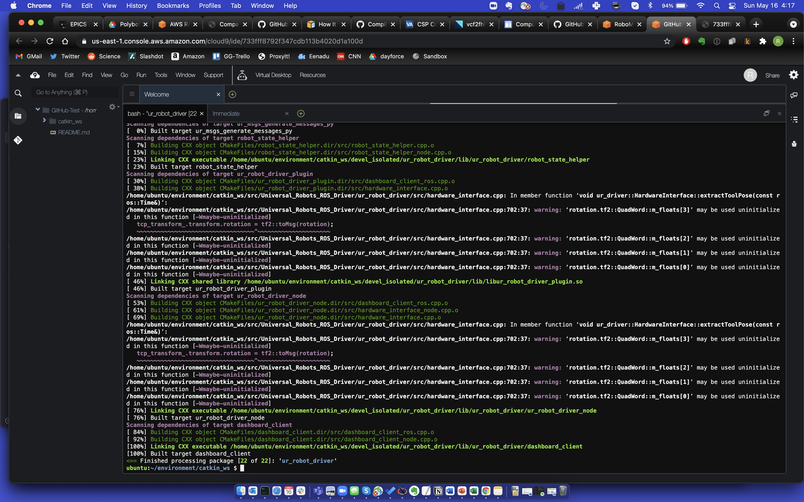
11. Launch UR3 Robot using ```roslaunch ur_gazebo ur5.launch``` 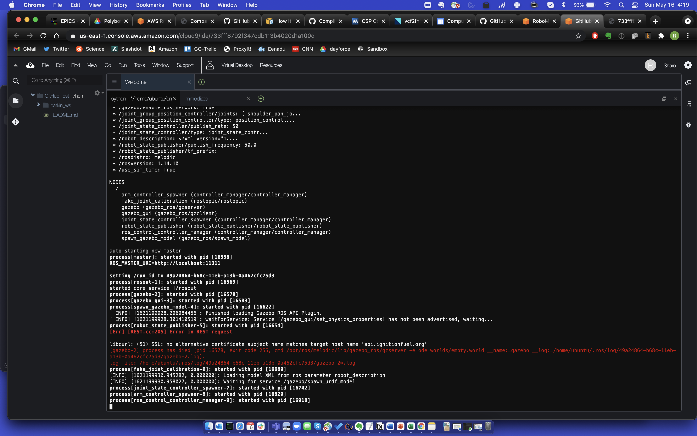
12. Command screen after last command 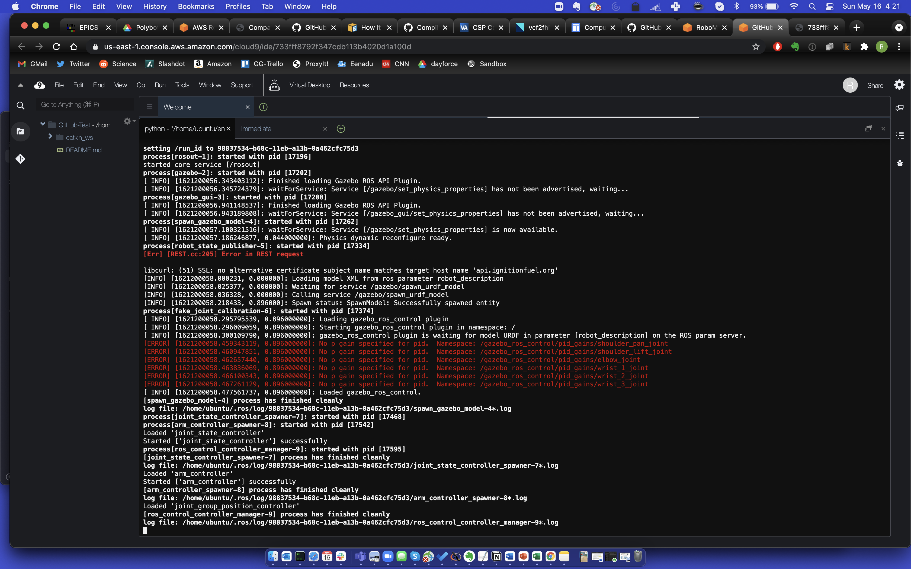
13. UR3E in Gazebo 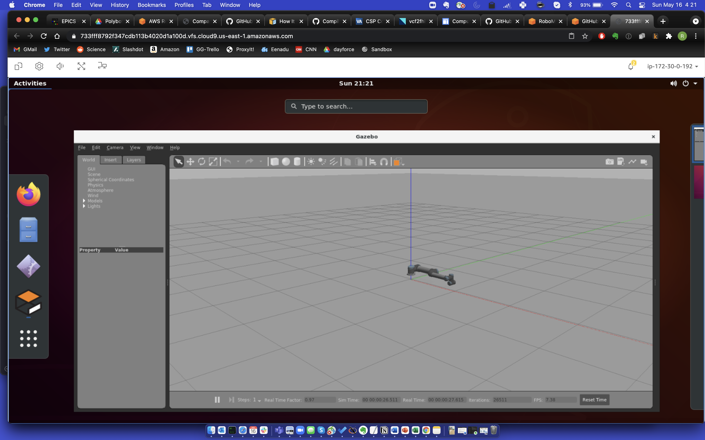


<br>
Useful links:<br>
1. AWS Tutorial on using TurtleBot with Robomaker: https://aws.amazon.com/blogs/aws/aws-robomaker-develop-test-deploy-and-manage-intelligent-robotics-apps/ <br>
2. Removing dpkg lock: https://itsfoss.com/could-not-get-lock-error/

